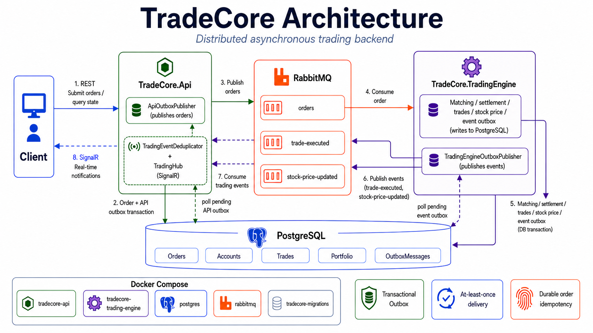

# TradeCore

TradeCore is a distributed, asynchronous trading backend built with .NET. It accepts trading requests over REST, persists durable state in PostgreSQL, processes submitted orders in a separate worker through RabbitMQ, and delivers trade and price updates to connected clients with SignalR.

TradeCore explores the practical backend challenges of building a reliable asynchronous order-processing system, including matching, settlement, transactional consistency, at-least-once messaging, idempotency, concurrency, real-time notifications, and containerized deployment.

## Overview

The API is responsible for HTTP requests, durable order submission, and client notifications. The Trading Engine is an independent worker that consumes submitted orders, matches them, settles accounts and portfolios, and records outgoing trading events. PostgreSQL is the system of record; RabbitMQ transports work and events between the processes.

Docker Compose runs the complete local environment: PostgreSQL, RabbitMQ, migrations, the API, and the Trading Engine.

## Key features

- REST endpoints for users, accounts, stocks, orders, portfolios, portfolio transfers, and trades.
- Asynchronous order processing through RabbitMQ.
- Price-time matching with partial fills and self-match prevention.
- Transactional account and portfolio settlement, trade persistence, and stock-price updates.
- EF Core migrations and PostgreSQL persistence.
- Transactional outboxes for order submission and post-settlement trading events.
- Durable submitted-order idempotency and at-least-once message delivery.
- Durable primary, retry, and dead-letter RabbitMQ queues with bounded processing attempts.
- RabbitMQ connection recovery, structured logging, SignalR notifications, and in-memory notification deduplication.
- In-process, per-stock concurrency protection and Docker Compose deployment.
- Unit and integration tests covering the principal application flows.

## Architecture overview




The API does not perform matching, and the Trading Engine does not communicate directly with SignalR clients. Shared message contracts provide the boundary between the two processes.

For messaging, transactions, recovery behavior, concurrency, and deployment details, see [TradeCore Architecture](docs/ARCHITECTURE.md).

## Technology stack

| Area | Technology |
| --- | --- |
| Backend | C#, .NET 10, ASP.NET Core |
| Persistence | PostgreSQL 17, Entity Framework Core 10, Npgsql |
| Messaging | RabbitMQ 4, RabbitMQ.Client |
| Real time | ASP.NET Core SignalR |
| Testing | xUnit, ASP.NET Core integration testing, Testcontainers for RabbitMQ |
| Deployment | Docker and Docker Compose |

## Project structure

| Project / directory | Purpose |
| --- | --- |
| `TradeCore.Api` | REST API, SignalR hub, API outbox publisher, trading-event consumer, migrations, and stock seeding. |
| `TradeCore.TradingEngine` | Worker host, submitted-order consumer, retry/DLQ handling, and Trading Engine outbox publisher. |
| `TradeCore.Messaging` | Shared RabbitMQ options and message contracts. |
| `TradeCore.Console` | Domain models, EF Core context, matching, settlement, portfolio, account, and trading services. |
| `TradeCore.Tests` | Unit and integration tests. |
| `docs` | Detailed technical documentation. |

## Order processing flow

1. A client submits an order to `TradeCore.Api`.
2. The API validates the request and atomically saves the order plus an API-owned `OrderSubmitted` outbox record.
3. `ApiOutboxPublisher` publishes the submitted-order message to RabbitMQ after the transaction commits.
4. `TradeCore.TradingEngine` consumes the message; a persisted processing claim makes duplicate deliveries safe.
5. The worker matches active orders and performs settlement in a database transaction.
6. The transaction commits trading state together with Trading Engine-owned `TradeExecuted` and `StockPriceUpdated` outbox records when trades occur.
7. `TradingEngineOutboxPublisher` publishes those events to RabbitMQ.
8. The API consumes events, suppresses recent duplicate notifications, and broadcasts them through SignalR.

## Matching rules

- Buy orders are ranked by highest price, then earliest creation time, then order ID.
- Sell orders are ranked by lowest price, then earliest creation time, then order ID.
- A trade requires a buy limit price greater than or equal to the sell limit price.
- The engine supports partial fills and skips orders belonging to the same account.
- The execution price is the older order's limit price. If both orders have the same creation time, the lower GUID determines the price.

## Reliability and messaging

### Transactional outbox

TradeCore commits database state and the intent to publish a message in the same transaction. The API outbox emits `OrderSubmitted`; the Trading Engine outbox emits `TradeExecuted` and `StockPriceUpdated` after settlement. A message is marked published only after RabbitMQ confirms it.

### At-least-once delivery and idempotency

TradeCore uses **at-least-once** messaging semantics. A successful broker publish can be retried if its local published marker cannot be saved.

Duplicate submitted-order messages are safe because the Trading Engine records a durable processing claim in the order's database row as part of the processing transaction. A delivery that has already been claimed does not repeat matching or settlement.

### Retry, dead-letter queues, and broker recovery

Each message family has a durable primary queue, retry queue, and dead-letter queue. Retries use the `x-tradecore-attempt` header and are bounded by `RabbitMq__MaxProcessingAttempts`; the retry delay is configured with `RabbitMq__RetryDelayMilliseconds`.

| Messages | Primary | Retry | Dead letter |
| --- | --- | --- | --- |
| Submitted orders | `orders` | `orders.retry` | `orders.dead-letter` |
| Trade events | `trade-executed` | `trade-executed.retry` | `trade-executed.dead-letter` |
| Stock-price events | `stock-price-updated` | `stock-price-updated.retry` | `stock-price-updated.dead-letter` |

The worker retries unavailable or closed RabbitMQ connections and recreates its consumer session. The API continues retrying pending outbox messages when its broker connection is unavailable; its trading-event consumer also retries connection failures.

## Real-time notifications

The API consumes `TradeExecuted` and `StockPriceUpdated` events and broadcasts them to all clients connected to the SignalR hub at `/hubs/trading`.

`TradingEventDeduplicator` retains event-type-and-ID keys in memory for 24 hours after a successful notification, preventing repeated broadcasts during that process lifetime. It is intentionally not durable or distributed deduplication.

## Concurrency

`StockProcessingLockRegistry` serializes matching and settlement for a given stock within a Trading Engine process. Processing for different stocks can proceed concurrently. This is in-process coordination, not a distributed lock.

## Database

PostgreSQL is the durable system of record, with Entity Framework Core used for persistence and migrations. Important persisted concepts include users, accounts, stocks, orders, trades, portfolio positions, portfolio transfers, and outbox messages. Trading settlement—including balance, portfolio, order, trade, price, and event-intent changes—is transactional.

## Run with Docker Compose

### Prerequisites

- Docker Desktop or Docker Engine with Docker Compose.
- The .NET 10 SDK is needed only for local development or running tests outside containers.

Start the full local system:

```bash
docker compose up -d --build
```

Check service status:

```bash
docker compose ps
```

Compose starts the following services:

| Service | Role |
| --- | --- |
| `postgres` | PostgreSQL database. |
| `rabbitmq` | RabbitMQ broker and management UI. |
| `tradecore-migrations` | One-shot migration and stock-seeding service; exits after it completes. |
| `tradecore-api` | REST API, SignalR host, API outbox publisher, and event consumer. |
| `tradecore-trading-engine` | Submitted-order consumer and event-outbox publisher. |

With default port mappings, useful local endpoints are:

| Service | Address |
| --- | --- |
| API | `http://localhost:5021` |
| OpenAPI / Swagger UI | `http://localhost:5021/swagger` |
| Health check | `http://localhost:5021/health` |
| RabbitMQ management UI | `http://localhost:15672` |

The Compose API service runs in the Development environment, so its OpenAPI document and Swagger UI are enabled. PostgreSQL, RabbitMQ AMQP, RabbitMQ management, and API host ports may be changed through `POSTGRES_PORT`, `RABBITMQ_AMQP_PORT`, `RABBITMQ_MANAGEMENT_PORT`, and `API_PORT`.
The Docker Compose setup is intended for local development and demonstration.

## Environment variables

`compose.yaml` accepts the following settings. Use a local `.env` file or shell environment variables; do not commit credentials.

| Variable | Purpose |
| --- | --- |
| `POSTGRES_DB`, `POSTGRES_USER`, `POSTGRES_PASSWORD` | Database name and credentials for the local PostgreSQL container. |
| `POSTGRES_PORT` | Host port mapped to PostgreSQL. |
| `RABBITMQ_USER`, `RABBITMQ_PASSWORD` | RabbitMQ container credentials. |
| `RABBITMQ_AMQP_PORT`, `RABBITMQ_MANAGEMENT_PORT` | Host ports for AMQP and the management UI. |
| `API_PORT` | Host port mapped to the API. |

Inside the application containers, Compose supplies `ConnectionStrings__TradeCoreDatabase`, `RabbitMq__Enabled`, `RabbitMq__HostName`, `RabbitMq__Port`, `RabbitMq__UserName`, `RabbitMq__Password`, `RabbitMq__OrdersQueue`, `RabbitMq__TradeExecutedQueue`, `RabbitMq__StockPriceUpdatedQueue`, `RabbitMq__MaxProcessingAttempts`, and `RabbitMq__RetryDelayMilliseconds`.

## API endpoints

| Area | Endpoints |
| --- | --- |
| Users | `POST /api/users`, `GET /api/users`, `GET /api/users/{id}` |
| Accounts and portfolios | `GET /api/users/{id}/account`, `POST /api/users/{id}/account/deposit`, `GET /api/users/{id}/portfolio` |
| Stocks | `GET /api/stocks`, `GET /api/stocks/{symbol}` |
| Orders | `POST /api/orders`, `GET /api/orders`, `GET /api/orders/{id}` |
| Trades | `GET /api/trades` |
| Portfolio transfers | `POST /api/portfolio-transfers`, `GET /api/portfolio-transfers`, `GET /api/portfolio-transfers/{id}`, `POST /api/portfolio-transfers/{id}/complete`, `POST /api/portfolio-transfers/{id}/reject` |
| Health | `GET /health` |
| SignalR | `/hubs/trading` |


### Example order request

Send a request to `POST /api/orders` after creating a user; user creation also creates an account, whose ID is available from `GET /api/users/{id}/account`. The stock symbol must exist.

```json
{
  "accountId": "00000000-0000-0000-0000-000000000000",
  "stockSymbol": "AAPL",
  "orderType": "Buy",
  "quantity": 1,
  "price": 180
}
```

`orderType` accepts the `Buy` and `Sell` enum values. The shown ID is a placeholder and must be replaced with an existing account ID.

## Automated tests

Build and run the test suite from the repository root:

```bash
dotnet build TradeCore.slnx
dotnet test TradeCore.slnx
```

The suite covers matching, settlement, API integration, request validation, concurrency, API and Trading Engine outboxes, idempotency, RabbitMQ recovery and delivery behavior, SignalR notifications, and structured logging.

## Failure behavior

| Scenario | Behavior |
| --- | --- |
| RabbitMQ is unavailable during order submission | The order and API outbox record remain durable; pending publication retries later. |
| A submitted-order message is delivered again | The durable processing claim prevents another settlement pass. |
| RabbitMQ is unavailable after a trade commits | The Trading Engine event outbox remains pending and retries later. |
| A broker connection closes | Consumers and publishers recover according to their implemented retry/reconnection logic. |
| Settlement transaction fails | Trading state and event-outbox records roll back together. |

## Important design decisions

- **Separate API and Trading Engine:** isolates client request handling from order execution.
- **RabbitMQ:** separates work asynchronously between the processes and provides durable queueing.
- **PostgreSQL and EF Core:** provide the transactional durable store.
- **Transactional outboxes:** avoid losing message intent across database and broker boundaries.
- **Durable order idempotency:** makes submitted-order redelivery safe for settlement.
- **SignalR through the API:** keeps the worker independent of client connections.
- **Per-stock in-process locking:** protects a single worker process while allowing independent stocks to progress concurrently.
- **Docker Compose:** supplies a reproducible multi-service local environment.

## What this project demonstrates

- Separating request handling from background execution.
- Designing reliable asynchronous workflows with at-least-once delivery and idempotent consumers.
- Coordinating transactional database state with external messaging.
- Applying trading matching rules, settlement, concurrency control, real-time event delivery, and integration testing in a local distributed system.

For a deeper explanation of messaging, transactions, failure handling, concurrency, and deployment, see [TradeCore Architecture](docs/ARCHITECTURE.md).
