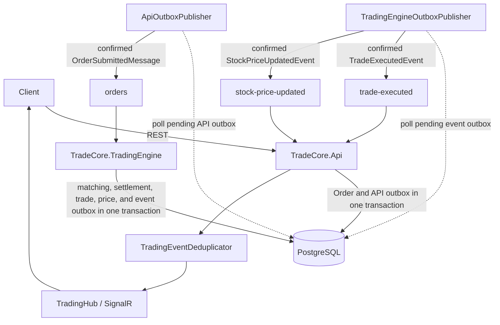
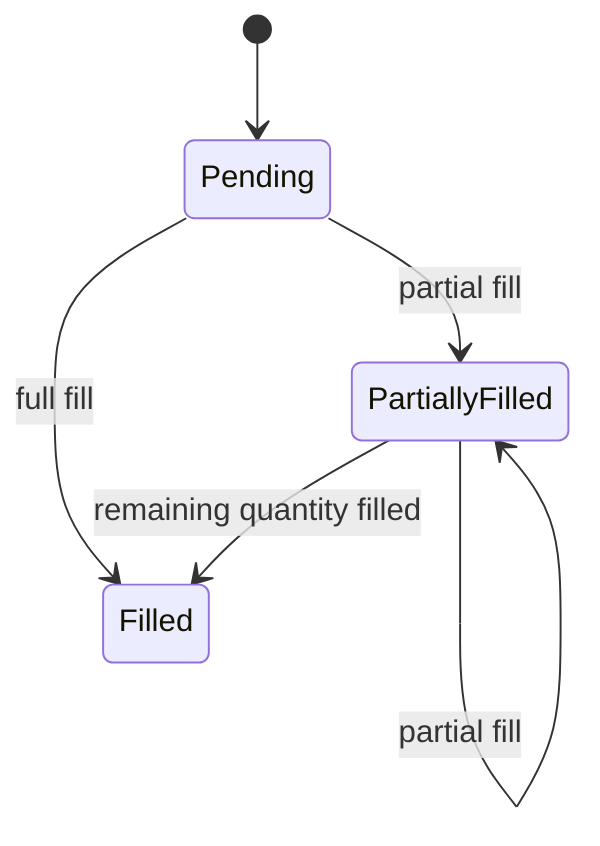

# TradeCore Architecture

TradeCore is a distributed, asynchronous trading backend. `TradeCore.Api` accepts REST requests and serves SignalR clients; `TradeCore.TradingEngine` is an independent worker that executes orders. PostgreSQL is the durable system of record, and RabbitMQ provides durable messaging with at-least-once delivery semantics between the processes. Docker Compose runs the local deployment.

## System overview



The API does not match orders, and the Trading Engine does not communicate with SignalR clients. The two processes have no direct project reference to each other and communicate through RabbitMQ contracts.

## Projects and dependency direction

| Project | Responsibility |
| --- | --- |
| `TradeCore.Api` | ASP.NET Core controllers, request validation, order submission, API-owned outbox publishing, trading-event consumption, SignalR, health endpoint, migrations, and seeding. |
| `TradeCore.TradingEngine` | Worker host, submitted-order consumer/reconnect lifecycle, retry/DLQ delivery handling, and Trading Engine-owned outbox publishing. |
| `TradeCore.Messaging` | Shared RabbitMQ options and message contracts: `OrderSubmittedMessage`, `TradeExecutedEvent`, and `StockPriceUpdatedEvent`. |
| `TradeCore.Console` | Shared domain models, `TradeCoreDbContext`, EF Core mapping, order book/matching, settlement, portfolio, account, and trading services. Its executable nature is separate from the reusable code consumed by the API and worker. |
| `TradeCore.Tests` | Unit and integration coverage for API, matching, outbox, concurrency, SignalR, and RabbitMQ behavior. |

`TradeCore.Api` and `TradeCore.TradingEngine` each reference `TradeCore.Console` and `TradeCore.Messaging`. `TradeCore.Console` references `TradeCore.Messaging`; `TradeCore.Messaging` has no project references. In particular, `TradeCore.TradingEngine` does **not** depend on `TradeCore.Api`.

## Persistence and transaction boundary

PostgreSQL, accessed through EF Core's `TradeCoreDbContext`, is the authoritative durable store. The currently mapped tables are `Users`, `Accounts`, `Stocks`, `Orders`, `OutboxMessages`, `Trades`, `PortfolioPositions`, and `PortfolioTransfers`. EF Core migrations are in `TradeCore.Api/Migrations`.

`OutboxMessage` stores the owner, type, JSON payload, timestamps, attempt count, and last error. `Order.SubmittedMessageProcessedAt` is a nullable column on `Orders`, not a separate table; it records the durable claim that the submitted-order message was processed.

Trading processing opens an EF Core database transaction. For a successful processing pass that produces trades, the same transaction includes the order-message claim, order state and remaining-quantity changes, account balance settlement, portfolio settlement, `Trade` rows, the stock current-price change, and the Trading Engine event-outbox rows. A failure rolls the transaction back, so neither the state changes nor its event-outbox records become durable. RabbitMQ publication happens only after that transaction has committed; it is not part of the database transaction.

## Order lifecycle, matching, and settlement

New orders start as `Pending`. `ApplyFill` supports these execution transitions:



Only `Pending` and `PartiallyFilled` orders are active for matching. `ApplyFill` accepts only these active states, so terminal orders cannot be filled again.

`OrderBookService` sorts buys by descending price, then `CreatedAt`, then order ID; it sorts sells by ascending price, then `CreatedAt`, then order ID. `OrderMatchingService` considers a match only when `buy.Price >= sell.Price`, supports partial fills, and skips orders from the same account. The execution price is the older order's limit price; when creation times are equal, it is the limit price of the lower-GUID order.

For each match, `TradeCreationService` checks that the buyer can debit the trade value and that the seller has sufficient shares. It debits the buyer, credits the seller, adds or updates the buyer position, reduces or removes the seller position, applies the fills, persists the `Trade`, and updates the stock's current price. These changes participate in the surrounding processing transaction.

## Transactional outboxes

### Order submission: API-owned outbox

Without an outbox, an API would have a dual-write gap: an order could be saved while the subsequent RabbitMQ publish fails. TradeCore instead performs this transaction:

```text
BEGIN
  insert Order
  insert API-owned OutboxMessage (OrderSubmitted)
COMMIT
```

`OrdersController` calls `OrderService.CreateOrderWithOutboxAsync` and returns `201 Created` only after this transaction commits. `ApiOutboxPublisher` repeatedly selects unpublished rows owned by `Api` whose type is `OrderSubmitted`; it does not select Trading Engine-owned rows. It deserializes the payload and calls `RabbitMqOrderMessagePublisher`, which publishes a persistent message with the order ID as its RabbitMQ message ID and waits for publisher confirmation. Only then does the publisher set `PublishedAt`.

Consequently, when RabbitMQ is unavailable, the API can still commit the order and outbox row and return `201`. The row remains pending (and records publication failures) until a later publishing attempt succeeds. If RabbitMQ confirmed a publish but saving `PublishedAt` fails, the row remains unpublished and may be sent again.

### Post-settlement events: Trading Engine-owned outbox

`OrderMessageHandler` no longer directly publishes trading events. `OrderProcessingService` creates event outbox records in the same transaction as matching and settlement. For each trade it creates one `TradeExecuted` outbox record. If that processing pass produced one or more trades, it creates one `StockPriceUpdated` record for the stock's final price in that pass.

`TradingEngineOutboxPublisher` selects unpublished rows owned by `TradingEngine`, publishes each event through `RabbitMqTradingEventPublisher` with publisher confirmations, and then sets `PublishedAt`. It records failures and retries pending rows. This keeps a RabbitMQ outage after a trade commit from losing the trade notification.

Event identity is deterministic from the trade that created it: each `TradeExecutedEvent.EventId` and `TradeId` are that trade's ID. The `StockPriceUpdatedEvent.EventId` is the ID of the last trade processed in that pass. The deduplicator includes the event type in its key, so the same GUID in the two event types remains distinct.

## Delivery, idempotency, and acknowledgements

The messaging design provides **at-least-once delivery**, not exactly-once delivery. An outbox record can be republished after a confirmed broker publish if persistence of `PublishedAt` fails.

Order-processing idempotency is durable and distinct from notification deduplication. At the start of `OrderProcessingService.ProcessOrderAsync`, a conditional database update sets `Orders.SubmittedMessageProcessedAt` only when it is null. That claim is inside the same transaction as processing:

```text
first delivery     -> durable claim -> matching and settlement
duplicate delivery -> claim exists  -> no-op
failed transaction -> claim rolls back
```

Therefore a redelivered `OrderSubmittedMessage` cannot create another trade, settlement, portfolio movement, fill, or Trading Engine event-outbox record. This also makes a first successful processing pass that found no match a durable no-op on later duplicate delivery.

The order consumer acknowledges the original RabbitMQ delivery only after `OrderMessageHandler` returns successfully, which follows the database commit. Immediate trading-event publication is not on this acknowledgement path; the committed Trading Engine outbox publishes independently afterward.

`TradingEventDeduplicator` solves a different problem: it suppresses duplicate API-side SignalR broadcasts after successful event handling. It reserves a `(event type, event ID)` key in memory for 24 hours and releases it if notification handling fails. This protects the real-time notification path during the retention period; it is not durable order-processing idempotency.

## RabbitMQ topology and recovery

The configured default queues are durable and use persistent messages:

| Message family | Primary | Retry | Dead letter |
| --- | --- | --- | --- |
| Submitted orders | `orders` | `orders.retry` | `orders.dead-letter` |
| Trade events | `trade-executed` | `trade-executed.retry` | `trade-executed.dead-letter` |
| Stock-price events | `stock-price-updated` | `stock-price-updated.retry` | `stock-price-updated.dead-letter` |

Each retry queue has `x-message-ttl` equal to `RabbitMq:RetryDelayMilliseconds` (the Compose configuration is 5000 ms) and dead-letters back to its primary queue. Consumers use the `x-tradecore-attempt` header. On successful handling they ACK. On a processing failure before the configured maximum (three in Compose), they publish a persistent retry copy and ACK the original only after that succeeds. Invalid messages or exhausted attempts are copied to the corresponding dead-letter queue before the original is ACKed. If that handoff cannot complete, the original delivery is intentionally left unacknowledged.

`RabbitMqOrderConsumer` owns the worker's reconnect lifecycle. At the application level, the worker can tolerate RabbitMQ being unavailable at startup and retry until connectivity is restored. In the provided Docker Compose deployment, normal startup is additionally gated by RabbitMQ's health check. If the live consumer connection or channel closes, its session is cleared and disposed, then a new connection, topology, consumer, and delivery transport are created before consumption resumes.

On the API order-publication path, `RabbitMqInitializationService` logs an initial connection failure without stopping the API. `ApiOutboxPublisher` continues attempting pending rows. `RabbitMqConnectionService` disposes a failed session and clears it, so the next publish attempt initializes a fresh connection and re-declares the orders queue. The API trading-event consumer separately retries connection/startup failures every two seconds; its documented retry/DLQ behavior applies once it is consuming.

## Real-time notifications

The notification flow is:

```text
TradingEngineOutboxPublisher
  -> RabbitMQ TradeExecutedEvent / StockPriceUpdatedEvent
  -> TradeCore.Api RabbitMqTradingEventConsumer
  -> TradingEventDeduplicator
  -> TradingEventNotificationHandler
  -> TradingHub
  -> SignalR clients
```

The hub endpoint is `/hubs/trading`. The API broadcasts `TradeExecuted` and `StockPriceUpdated` to all connected clients. The event consumer ACKs a notification delivery only after the SignalR handler succeeds; handling failures follow the event retry/DLQ topology.

## Concurrency

`StockProcessingLockRegistry` uses a keyed `SemaphoreSlim`. The Trading Engine acquires the semaphore for the submitted order's stock before starting the transaction, so orders for the same stock are serialized while orders for different stocks may be processed concurrently. Entries are removed when no caller holds or waits on a stock's semaphore.

This is in-process protection only. It is not a distributed lock; running multiple Trading Engine processes would require additional distributed coordination to obtain the same guarantee across processes.

## Failure behavior

| Scenario | Implemented behavior |
| --- | --- |
| RabbitMQ unavailable while submitting an order | The order and API outbox row commit, the API can return `201`, and the pending outbox row is published after a successful later attempt. |
| Duplicate submitted-order delivery | The durable `SubmittedMessageProcessedAt` claim already exists, so matching and settlement are skipped. |
| Trading Engine starts while RabbitMQ is unavailable | The process remains alive and retries connection with the bounded reconnect delay. |
| Broker connection drops while the worker is consuming | The stale worker session is disposed; the worker reconnects, recreates topology/consumer state, and resumes consuming. |
| RabbitMQ unavailable after trade commit | The trade and Trading Engine event outbox are already durable; unpublished events remain pending for later publication. |
| Broker accepts an event but `PublishedAt` cannot be saved | The event can publish again with the same deterministic event ID; the API deduplicator suppresses duplicate SignalR notification during its 24-hour in-memory retention. |
| Database failure during settlement | The processing transaction rolls back the claim, trading state, and event outbox together; the order delivery is not successfully acknowledged. |

## Docker Compose deployment

`compose.yaml` defines these independent services:

| Service | Role |
| --- | --- |
| `postgres` | PostgreSQL 17 durable database. |
| `rabbitmq` | RabbitMQ 4 broker and management UI. |
| `tradecore-migrations` | One-shot API image that applies migrations and seeds stocks, then exits. |
| `tradecore-api` | REST API, SignalR server, API outbox publisher, and event consumer. |
| `tradecore-trading-engine` | Submitted-order consumer and Trading Engine outbox publisher. |

`postgres-data` and `rabbitmq-data` are persistent named volumes. PostgreSQL exposes `${POSTGRES_PORT:-5432}:5432`; RabbitMQ exposes `${RABBITMQ_AMQP_PORT:-5672}:5672` and management `${RABBITMQ_MANAGEMENT_PORT:-15672}:15672`; the API exposes `${API_PORT:-5021}:8080`. The defaults are host ports 5432, 5672, 15672, and 5021 respectively.

Within Compose, application services use `postgres:5432` and `rabbitmq:5672`, never `localhost`. PostgreSQL and RabbitMQ have health checks. The migration service waits for healthy PostgreSQL; the API and Trading Engine wait for healthy RabbitMQ and successful completion of migrations. The API has a `/health` health check on its internal port 8080. API and worker remain separate running services after those dependencies are ready.

## Architecture decisions

* **Separate API and Trading Engine** - isolates client request handling from execution work.
* **RabbitMQ** - supplies asynchronous process separation and durable, retryable message delivery.
* **Transactional outboxes** - prevent PostgreSQL/RabbitMQ dual-write loss for both order submission and post-settlement events.
* **PostgreSQL with EF Core** - provides the durable transactional trading state.
* **Durable order idempotency** - makes broker redelivery safe for matching and settlement.
* **Per-stock locking** - protects same-stock processing within one worker process.
* **SignalR through the API** - keeps client-facing real-time delivery outside the worker.
* **Deterministic event IDs plus deduplication** - make at-least-once event publication safe for SignalR notifications during the retention window.
* **Docker Compose** - runs the API, worker, database, broker, and migrations as independent local services.
